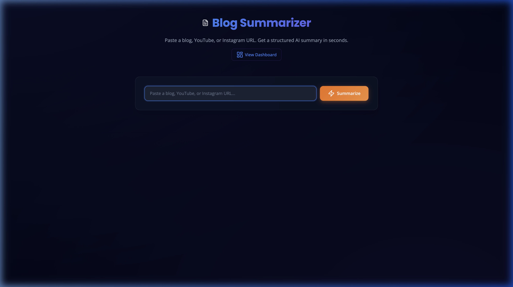

# 🧠 Reelist — Insta Reel, YouTube & Blog Summarizer

> **Stop hoarding tabs and saved reels you'll never rewatch.**

You know the drill: 47 open tabs, 200 saved Instagram reels, a YouTube "Watch Later" that's basically a graveyard. You *saved* all that knowledge — you just never get it back out.

**This fixes that.** Paste any URL — a blog post, a YouTube video, an Instagram reel — and in seconds you get a structured AI summary: key points, difficulty rating, tools mentioned, and the one takeaway that matters. Everything lands in a searchable personal knowledge base. On your phone? Just share the link to your Telegram bot and the summary comes right back in chat.

- ⚡ **Fast** — summaries powered by `gpt-oss-120b` on Groq (fastest inference on the market)
- 🎙️ **No captions? No problem** — reels and caption-less videos get transcribed locally with Whisper
- 📱 **Zero-friction mobile** — share from Instagram → Telegram bot → summarized, saved, done
- 🔒 **Yours** — SQLite on your machine, your API keys, no third-party tracking

**Built with:** Python · FastAPI · Groq (gpt-oss-120b) · faster-whisper · SQLite · Vanilla JS

---

## 📸 Screenshots

| Homepage | Dashboard |
|----------|-----------|
|  |  |

---

## ✨ Features

### 🚀 Universal Summarization
- **Blogs & Articles** — Scrapes any webpage with BeautifulSoup, strips the junk, summarizes the content.
- **YouTube Videos** — Fetches transcripts via the YouTube Transcript API. No transcript? Falls back to downloading the audio with `yt-dlp` and transcribing locally with **faster-whisper**.
- **Instagram Reels** — Downloads reel audio, transcribes with Whisper, summarizes.

### ⏱️ Real-Time Progress
- Live SSE (Server-Sent Events) stepper shows every stage: detection → scraping/downloading → transcription → AI summary → saved.

### 🗂️ Smart Knowledge Base
- **AI Categorization** — auto-tagged into AI, Web Dev, ML, Cybersecurity, or General.
- **Difficulty Scoring** — Beginner / Intermediate / Advanced.
- **Smart Search** — across titles, summaries, key points, and tools mentioned.
- **Sorting & Filters** — by date, difficulty, title, category, or source domain.

### ⭐ Personalization & Export
- **Favorites** — star summaries, filter to favorites only.
- **Manual Editing** — refine any AI summary; edits get an "Edited" badge.
- **Export** — copy as Markdown or download `.md` for Notion / Obsidian.

### 🤖 Telegram Bot
- **Share from anywhere** — send any URL to your bot, get the summary back in chat.
- **Works locally out of the box** — long-polling mode means **no ngrok, no webhook setup** for local dev.
- **Same knowledge base** — bot summaries appear on your dashboard too.

---

## 🚀 Getting Started

### Prerequisites

| Requirement | Details |
|-------------|---------|
| **Python** | 3.9+ |
| **ffmpeg** | Audio processing. `brew install ffmpeg` (macOS) / `sudo apt install ffmpeg` (Linux) |
| **Groq API Key** | Free at [console.groq.com/keys](https://console.groq.com/keys) |

### 1. Clone

```bash
git clone https://github.com/hemish22/insta-reel-shorts-blogs-summariser-.git
cd insta-reel-shorts-blogs-summariser-
```

### 2. Install dependencies

```bash
cd blog_summarizer/backend
pip install -r requirements.txt
```

> faster-whisper downloads its model (~75 MB, `tiny`) automatically on first transcription.

### 3. Configure API keys

```bash
cp .env.example .env
```

Edit `blog_summarizer/backend/.env`:

```env
GROQ_API_KEY=gsk_your_actual_key_here          # required
TELEGRAM_BOT_TOKEN=123456:ABC-your_token_here  # optional — only for the Telegram bot
```

> 🔒 `.env` is git-ignored. Your keys never leave your machine.

### 4. Run

```bash
uvicorn main:app --reload
```

### 5. Open

| Page | URL |
|------|-----|
| Homepage | [http://localhost:8000](http://localhost:8000) |
| Dashboard | [http://localhost:8000/dashboard](http://localhost:8000/dashboard) |

### 6. (Optional) Telegram bot — 2 minutes, no ngrok

1. Message **@BotFather** on Telegram → `/newbot` → copy the token
2. Put it in `.env` as `TELEGRAM_BOT_TOKEN`
3. Restart the server — that's it

The server auto-detects local mode and uses **long-polling**: no public URL, no webhook, no tunnel. Send your bot any link and watch the summary come back. (When deployed to Render, it automatically switches to webhook mode instead.)

---

## ☁️ Deployment

| Piece | Where | How |
|-------|-------|-----|
| **Backend** | Render | `render.yaml` blueprint included — connect the repo, set `GROQ_API_KEY` + `TELEGRAM_BOT_TOKEN` in the dashboard. Telegram webhook registers itself on boot. |
| **Frontend** | Vercel | `blog_summarizer/frontend/` deploys as a static site; it auto-points API calls at the Render backend when served from a `*.vercel.app` domain. |

---

## 📁 Project Structure

```
insta-reel-shorts-blogs-summariser-/
├── blog_summarizer/
│   ├── backend/
│   │   ├── main.py                 # FastAPI app, routes, SSE streaming, Telegram handling
│   │   ├── llm_service.py          # Groq (gpt-oss-120b) integration + robust JSON parsing
│   │   ├── scraper.py              # Blog/article scraping (BeautifulSoup)
│   │   ├── youtube_service.py      # YouTube transcripts + Whisper fallback
│   │   ├── instagram_service.py    # Instagram Reel detection + transcription
│   │   ├── audio_service.py        # yt-dlp audio downloading
│   │   ├── whisper_service.py      # faster-whisper transcription
│   │   ├── transcript_cleaner.py   # Filler-word removal, text cleanup
│   │   ├── telegram_service.py     # Bot API helpers: polling, webhook, formatting
│   │   ├── database.py             # SQLite schema + CRUD
│   │   ├── models.py               # Pydantic models
│   │   ├── requirements.txt
│   │   └── .env.example
│   ├── frontend/
│   │   ├── index.html              # Homepage — URL input + live progress
│   │   ├── dashboard.html          # Knowledge base UI
│   │   ├── styles.css              # Design system (dark mode)
│   │   └── script.js               # Filters, favorites, export, SSE client
│   └── docs/screenshots/
├── Dockerfile                      # Render deployment
├── render.yaml                     # Render blueprint
└── README.md
```

---

## 🔌 API Endpoints

| Method | Endpoint | Description |
|--------|----------|-------------|
| `GET` | `/` | Homepage |
| `GET` | `/dashboard` | Dashboard |
| `POST` | `/summarize-stream` | Summarize with real-time SSE progress |
| `POST` | `/summarize` | Summarize (non-streaming) |
| `GET` | `/summaries` | All saved summaries |
| `DELETE` | `/summaries/{id}` | Delete a summary |
| `POST` | `/summaries/{id}/favorite` | Toggle favorite |
| `PUT` | `/summaries/{id}/edit` | Edit summary text |
| `POST` | `/telegram-webhook` | Telegram webhook (production mode) |
| `GET` | `/telegram-setup` | Manual webhook registration helper |

### Example

```bash
curl -X POST http://localhost:8000/summarize \
  -H "Content-Type: application/json" \
  -d '{"url": "https://example.com/some-article"}'
```

```json
{
  "title": "Article Title",
  "domain": "example.com",
  "difficulty": "Intermediate",
  "category": "Web Dev",
  "summary": "A concise summary of the article...",
  "key_points": ["Key point 1", "Key point 2"],
  "takeaway": "The main actionable insight.",
  "original_url": "https://example.com/some-article"
}
```

---

## ⚙️ Configuration Reference

All config lives in `blog_summarizer/backend/.env`:

| Variable | Required | Description |
|----------|----------|-------------|
| `GROQ_API_KEY` | ✅ | Free key from [console.groq.com/keys](https://console.groq.com/keys) |
| `TELEGRAM_BOT_TOKEN` | ❌ | From [@BotFather](https://t.me/BotFather) — only for Telegram integration |

> SQLite needs zero config. Whisper models download on first use.

---

## 🐛 Troubleshooting

| Issue | Solution |
|-------|----------|
| `ModuleNotFoundError` | `pip install -r requirements.txt` |
| `ffmpeg not found` | `brew install ffmpeg` / `sudo apt install ffmpeg` |
| `GROQ_API_KEY not set` | Create `.env` (step 3) |
| Port 8000 in use | `lsof -ti:8000 \| xargs kill -9` |
| Telegram bot silent | Another instance (e.g. a Render deploy) may own the webhook — the local server clears it on startup; restart the server |
| Instagram/YouTube download fails | `pip install --upgrade yt-dlp` |

---

## 📝 License

MIT — free for personal and commercial use.

---

<p align="center">
  Built with ❤️ by <a href="https://github.com/hemish22">hemish22</a>
</p>
